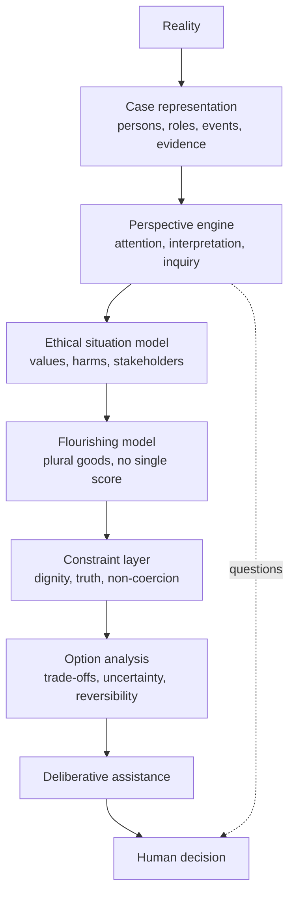

# Integral Ethics: Computational Assistance for Human Flourishing

Sep 22, 2026 · @Someone

## Status and change notice

Draft v2.0, unratified. It supersedes *Integral Ethics: A Twelve-Fold Foundation for Human Flourishing*. The twelve-fold worldview taxonomy is removed as a foundation; perspectival plurality is kept as a method and grounded independently.

| Area | v1 (twelve-fold) | v2 (this draft) |
| --- | --- | --- |
| Grounding of values | Worldview → value hierarchy → integrated ethics | Human reality + evidence + argument + lived experience → candidate dimensions, each justified on its own |
| Role of perspectives | Twelve metaphysical standpoints in a circular order | Cognitive instruments for finding what a judgment missed |
| Tier 0 | "Integral Consciousness": holding all twelve | Integrative ethical reasoning: a testable reasoning competency |
| Steiner | Load-bearing | Inspiration, one paragraph of intellectual history |
| Evidence standard | Speculative derivation | Every load-bearing claim entered in the Evidence register with strength and status |

Rule for this version: no claim enters the framework without an entry in the Evidence register. A claim marked Hypothesis may be used only as a hypothesis under test.

## Disposition of v1

Most of v1's value content and its empirical citations survive. What goes is the derivation route and the prescriptive applications. Source: [v1 manuscript](https://github.com/Skreen5hot/ariadne/blob/main/docs/01-philosophy/integral-ethics.md).

| v1 section | Disposition in v2 |
| --- | --- |
| §1.1 Current impasse (monism, eclecticism, relativism) | Keep as motivation |
| §1.2 Metaphysical problem; "perspectival realism" | Keep the term; re-ground it in Foundations, not in worldviews |
| §1.3 Four empirical findings | Keep 1–3 as evidence for C1 and relationships; treat 4 as contested |
| §2 Twelve worldviews; completeness claim | Remove; one paragraph in Intellectual history |
| §3 Value hierarchies derived from each worldview | Remove the derivation; each value's cited evidence moves to the candidate table |
| §4.2 Three meta-commitments | Keep as C1, C2, C3, with worldview grounding removed |
| §4.3 Tiers 0–4, 23 values | Keep all 23 as candidates; tier placements become first-pass hypotheses |
| §4.5 Integration procedure | Drop step 1 (identify worldviews); steps 2–7 become Option analysis and Deliberative assistance rules |
| §4.6 Comparisons with other theories | Rewrite later, after admission results exist |
| §5 Applications | Rewrite as deliberative-assistance cases; see below |
| §6.1 Relativism objection | Keep; the scientific-instruments analogy fits perspectival realism well |
| §6.2 Complexity; §6.3 who decides | Keep, re-worded around perspectives and human decision |
| §6.4 Steiner objection | Remove; the objection no longer applies |
| §6.5 Power; §6.6 structured incommensurability | Keep both |

**Why §5 must change, not just be re-grounded.** v1 §5 gives verdicts: choose one tradition by 35, commit before feelings stabilize, a specific abortion policy. Those conflict with the v2 thesis that the system does not make the moral decision. Several also rest on thin evidence. In v2 each application becomes a case: what is at stake, which goods conflict, what is unknown, and a range of responses.

## Abstract and thesis

**Thesis.** Integral Ethics is a reality-grounded, pluralistic computational framework. It helps human beings recognize what matters, understand conflicts among genuine goods, evaluate possible actions and consequences, and choose better in service of human flourishing. It does not reduce flourishing to a single metric, and it does not make the moral decision for the person. Only an agent decides. In phase one that agent is a human using the system; the synthetic moral agent is intended to use the same deliberative faculty later.

Five commitments carry the framework. Reality comes first: assistance operates on the world as best we can establish it. Human flourishing is the telos, and it has many dimensions. Plural values form the moral landscape, and genuine goods can conflict without either being unreal. Cognitive perspectives are tools for overcoming blind spots, not metaphysical standpoints. Computation aids human judgment and never replaces it.

Each commitment is argued from ontology, philosophy or empirical research, and its current standing is recorded in the Evidence register. Where the evidence is thin, the claim is stated as a hypothesis with a planned test.

## Intellectual history

Rudolf Steiner's perspectival philosophy was an important inspiration for Integral Ethics. His key insight was that a single standpoint can show genuine aspects of reality, yet distorts when absolutized. Developing the computational framework led away from his twelve-fold taxonomy. Integral Ethics keeps the methodological commitment to perspectival plurality. It grounds its models of cognition, value and flourishing independently, in contemporary ontology, philosophy, psychology, social science and empirical evidence.

Citation correction: v1 attributes the twelve worldviews to *The Riddles of Philosophy*. They are set out in Steiner's 1914 Berlin lectures, published as *Human and Cosmic Thought* (GA 151). Verify the edition before citing.

The break was reached by testing, not by preference. Several successive attempts tried to validate the twelve as a structure for values: salience-first alignment (VWA), value primitive–worldview correspondence (VPWC), and the worldview realization "Dial" (WRM). Each attempt required the twelve as an input, a benchmark, or an answer-shape. None could establish them from evidence independent of the taxonomy. The framework therefore stops depending on that question.

Three things from those attempts carry forward. Situations can be represented as graphs of entities and relations. Perspectives can be modelled as operators that change what is attended to and how it is appraised. Claims about perspectives can be tested against pre-registered nulls.

## Foundations: perspectival realism

There is one reality, and it can be known under many veridical but partial views. Perspectives differ in what they select, not in which world they are about. This is realism, not relativism.

**Ontological ground (BFO).** Basic Formal Ontology's SNAP/SPAN design treats continuants and occurrents as complementary views of one reality, neither reducible to the other. Granular partition theory adds that one reality admits many partitions at different grains. Each partition can be true of its domain without being complete.

**Classical ground (Thomist).** Things are known according to the mode of the knower: *quidquid recipitur per modum recipientis recipitur*. Knowledge is aspect-relative, while its object remains one. A standpoint that shows one aspect truly still leaves other aspects out.

**Formal argument.** Any finite representation of a situation is produced by a selection over it, so it omits something. Adding a second selection increases coverage only when it is not redundant with the first. Two conclusions follow:

1. No single perspective is guaranteed to capture all morally relevant features of a case (P1).
2. More perspectives help only when they are demonstrably diverse, so diversity must be tested, not assumed (P2).

Neither conclusion fixes the number or identity of the perspectives. That remains an empirical question; see Research questions.

## Core commitments

Eight commitments carry over from v1, each now argued without the worldview derivation. The IDs are keys into the Evidence register.

| ID | Commitment | Independent ground |
| --- | --- | --- |
| C1 | Flourishing has many dimensions; it is not reducible to pleasure, preference, wealth, autonomy or any single good | Basic-goods theory; multidimensional wellbeing research |
| C2 | Human dignity constrains how flourishing may be pursued | Deontic side-constraints; Thomist natural law |
| C3 | Assistance operates on reality as best established, not on wishful narratives | Realism; decision science on biased inputs |
| C4 | Genuine values can conflict without one being unreal | Value pluralism; incommensurability and parity |
| C5 | Integration, not reduction: no neutral aggregation into one score | Arrow's impossibility theorem; multi-criteria decision analysis |
| C6 | Context changes reasonable action: necessity, vulnerability, development, reversibility | Practical-wisdom tradition; quasi-option value for irreversibility |
| C7 | Non-coercion, transparency and epistemic humility are safeguards | Automation-bias research; wisdom research |
| C8 | There are many legitimate paths to flourishing, but not all paths are equally good | Basic goods admit many realizations; pluralism without relativism |

C8 is the hinge between pluralism and realism. Plurality holds at the level of realizations. Realism holds at the level of the goods realized.

C1–C3 are v1's three meta-commitments (§4.2) with the worldview grounding removed. C6's priority rules are v1 §4.5 step 6, unchanged: necessity for flourishing, irreversibility, developmental appropriateness, individual variation.

## Cognitive perspectives as instruments

A perspective is a configuration of six cognitive operations applied to a case. Its ethical job is to surface morally relevant reality that a judgment missed. It is a diagnostic tool, not a source of values.

```latex
\text{Perspective} = \text{Attention} + \text{Interpretation} + \text{Evidence} + \text{Explanation} + \text{Evaluation} + \text{Inquiry}
```

| Operation | What it governs | Failure it guards against | Grounding literature |
| --- | --- | --- | --- |
| Attention | Which entities and relations are noticed | Bounded awareness; ethical fading | Chugh & Bazerman; Tenbrunsel & Messick; Simons & Chabris |
| Interpretation | How facts are framed | Framing effects | Tversky & Kahneman |
| Evidence | Which data are sought and weighed | Confirmation bias | Lord, Lepper & Preston (consider-the-opposite) |
| Explanation | Which causal story is built | Premature closure on one story | Pennington & Hastie (story model); Heuer (competing hypotheses) |
| Evaluation | Which goods and harms register | Single-value reduction | Value pluralism; Schwartz value structure |
| Inquiry | Which questions get asked | Imagined rather than obtained answers | Eyal, Steffel & Epley (perspective-getting) |

**Status.** Each operation is grounded separately. The six-part decomposition as a whole is a Hypothesis (H-P6). It is not yet shown to be exhaustive, independent, or better than other ways of cutting the space.

**The perspective-getting constraint.** Imagining another person's view did not improve accuracy about that person across many experiments; asking them did. The perspective engine therefore produces questions, gap flags and alternative framings. It never simulates stakeholder testimony and then treats the simulation as evidence. Any inference about an absent person is labelled as a conjecture awaiting confirmation.

Worked example. A parent sees a son's inactivity. Attention asks what else is present: goals, perceived competence, friends. Interpretation offers alternatives: rest, discouragement, or a plan not yet visible. Inquiry turns these into questions to ask the son, not conclusions about him.

## Candidate value ontology

Every value from v1 re-enters as a candidate, not a settled item. A candidate is admitted only after it passes an eight-question protocol, with each answer recorded as an Evidence register entry.

**Admission protocol**

1. Role: is it a terminal good, a constituent of flourishing, an instrument, a constraint, or a combination?
2. Ontological kind: under BFO, what is it (disposition, quality, process, relational entity, information content)?
3. Evidence: what supports its relation to flourishing, and how strong is that support?
4. Scope: is it universal, conditional, developmental, culturally variable, or personally chosen?
5. Pathology: what are its characteristic excesses and deficiencies?
6. Conflicts: which other values can it conflict with, and in which situations?
7. Assessability: can it be measured, or only qualitatively assessed?
8. Authority: who determines how it is realized in a particular person's life?

**Candidate list and first-pass role hypotheses**

| v1 # | Candidate | v1 tier | Evidence v1 cites | First-pass role in v2 |
| --- | --- | --- | --- | --- |
| 1 | Human flourishing | 1 Terminal | Ryan & Deci (2001); Keyes (2002) | Telos; the whole the others constitute |
| 2 | Human dignity | 1 Terminal | Philosophical only | Constraint (C2) |
| 3 | Truth / reality-alignment | 1 Terminal | Philosophical only | Constraint and good (C3) |
| 4 | Material wellbeing | 2 Constitutive | Diener & Biswas-Diener (2002) | Constituent |
| 5 | Experiential richness | 2 Constitutive | Diener et al. (1999) | Constituent; test overlap with hedonic wellbeing |
| 6 | Meaningful relationships | 2 Constitutive | Waldinger & Schulz (2023); Baumeister & Leary (1995) | Constituent |
| 7 | Mastery and excellence | 2 Constitutive | Deci & Ryan (2000) | Constituent |
| 8 | Wisdom | 2 Constitutive | Ardelt (2003) | Constituent and competency |
| 9 | Virtue / character | 2 Constitutive | Peterson & Seligman (2004) | Constituent |
| 10 | Meaning and purpose | 2 Constitutive | Steger (2012) | Constituent |
| 11 | Authentic agency | 2 Constitutive | Ryan & Deci (2000); Wood et al. (2008) | Constituent and constraint |
| 12 | Spiritual vitality | 2 Constitutive | Koenig (2012); Hood (2001) | Constituent; scope contested |
| 13 | Harmonic structure | 2 Constitutive | Sirgy & Wu (2009) | Rename "life-domain balance"; may be a property of the profile, not a dimension |
| 14 | Cultural embeddedness | 3 Instrumental | Oishi & Diener (2009) | Conditional instrument |
| 15 | Commitment and rootedness | 3 Instrumental | Rusbult et al. (1998) | Instrument |
| 16 | Critical reflection | 3 Instrumental | Wilson & Dunn (2004) | Competency |
| 17 | Community accountability | 3 Instrumental | Cialdini & Goldstein (2004) | Instrument and constraint |
| 18 | Freedom to exit | 3 Instrumental | Patall et al. (2008) | Constraint |
| 19 | Graduated autonomy | 3 Instrumental | Soenens & Vansteenkiste (2010) | Developmental rule under C6 |
| 20 | Non-coercion | 4 Constraining | None | Constraint (C7) |
| 21 | Transparency | 4 Constraining | None | Constraint (C7) |
| 22 | Epistemic humility | 4 Constraining | None | Competency |
| 23 | Limited pluralism | 4 Constraining | None | Principle (C8), not a value |

v1's Tier 0, Integral Consciousness, moves to Integrative ethical reasoning, carrying its citations: Commons et al. (1990), Labouvie-Vief (2003), Kegan (1994).

A citation is not yet evidence of fit. Several v1 citations support a neighbouring claim rather than the stated one. Patall et al. (2008) concerns choice and intrinsic motivation, not exit rights. Cialdini & Goldstein (2004) reviews compliance, not the benefits of accountability. Protocol question 3 must test fit for each citation, not just its existence.

**ValueNet is the item base and the ontological pattern.** In the BFO-Aligned ValueNet a value is a realizable entity, a disposition or a role, borne by an agent and realized in processes. Protocol question 2 is therefore answered by the pattern for every candidate. It also splits the v1 list. Care, fairness, honesty and the other moral-foundation items are value dispositions. Material wellbeing, relationships and meaning are states or goods that dispositions aim at, not dispositions themselves. v1 called both kinds "values"; v2 keeps them apart. ValueNet's foundation/contravening-process pairs (harm contravenes care, cheating contravenes fairness, and so on) become the harms half of the Ethical Situation Model. Its 222 mapping annotations to the original ValueNet are weak by design and stay annotations here too.

## Integrative ethical reasoning

Tier 0 is no longer "Integral Consciousness" defined as holding all twelve perspectives. It is a reasoning competency the system must have and demonstrate.

**Definition.** Integrative ethical reasoning is the capacity to recognize the multiple morally relevant dimensions of a situation. It includes understanding their relations and conflicts, resisting premature reduction to one value, and revising judgment in response to evidence and other perspectives.

It is a competency, not a value. It ranks alongside neither health nor dignity. It is the capacity by which such goods are seen and weighed together.

**Operational markers.** Wise-reasoning research already measures close analogues in people: intellectual humility, recognition that situations change, consideration of others' perspectives, and search for compromise. The system version is scored on four observable markers:

- **Coverage:** morally relevant considerations identified, against an expert-annotated reference for the case.
- **Conflict exposure:** genuine value conflicts named rather than silently resolved.
- **Uncertainty separation:** facts, predictions, preferences, obligations and values kept distinct.
- **Revision:** judgment updates appropriately when new evidence or a new stakeholder view arrives.

In Thomist terms this is close to *prudentia*: the virtue that sees the particulars of a case correctly. The framework claims only the measurable markers above; whether they amount to prudence is a further question.

## Computational architecture

The pipeline runs from reality to a human decision. Each stage adds structure, and none of them issues the decision.



The dashed line is the perspective-getting constraint: the engine sends open questions back to people, rather than filling gaps with simulation.

| Stage | Output | Rule |
| --- | --- | --- |
| Case representation | BFO/CCO-conformant situation graph | Facts carry provenance; unknowns stay explicit |
| Perspective engine | Gap flags, alternative framings, questions | Adds no facts |
| Ethical situation model | Values at stake, harms and benefits, affected parties | Every item traces to the graph or to a question |
| Flourishing model | Effects per dimension of flourishing | No aggregation into one score |
| Constraint layer | Constraint violations flagged | Constraints are never traded off inside an optimizer |
| Option analysis | Options with consequences, trade-offs, uncertainty, reversibility, distribution | Irreversible options flagged first |
| Deliberative assistance | What is at stake; the conflicts; what we don't know; possible responses | Recommends only when asked; shows its reasons |

The WRM work transfers here. Its graph representation becomes the case representation. Its dial mechanism becomes the perspective engine, with operators justified by the six operations, not by the twelve.

ValueNet supplies the vocabulary at two stages. In case representation, harms are value violation processes that contravene borne dispositions. In the situation model and in E-PC scoring, every consideration is a ValueNet value evidence annotation: a text span, selected by a text span selector, that is evidence for a value realization process.

## Research questions and falsification program

The question "are the twelve worldviews real?" is retired. The program now asks:

1. What constitutes human flourishing, and which candidate dimensions pass the admission protocol?
2. How can many dimensions be represented without a false common unit?
3. How does the system identify who is affected and what matters to them?
4. How are facts, predictions, preferences, obligations, values and uncertainties kept distinct?
5. How does the system expose genuine value conflicts rather than resolve them prematurely?
6. Which constraints must never be hidden inside optimization?
7. How can the system broaden perspective without manufacturing facts?
8. How can it assist judgment without replacing human moral agency?

**E-PC: Perspective Coverage Experiment.** This is the primary test of the method. It reuses the E2 machinery.

- **Materials:** frozen scenarios meeting the multi-relational completeness standard. Each is annotated by independent experts with the morally relevant considerations, each recorded as a ValueNet value evidence annotation with a text span selector.
- **Arms:** (a) baseline analysis; (b) the six-operation perspective engine; (c) a placebo arm with equally long, content-free prompts.
- **Primary outcome:** coverage of expert-annotated considerations, (b) against (c). Significance is tested with a pre-registered permutation test at p ≤ 0.05.
- **Safety outcome:** the rate of fabricated facts or simulated testimony. Any rise in (b) over (a) fails the method, whatever its coverage gain.
- **Diversity check (P2):** each operation's unique coverage contribution. An operation with no unique contribution is a candidate for removal.

**Kill conditions.** The perspective method fails if (b) does not beat (c) on coverage, or if (b) raises fabrication. H-P6 fails if a different decomposition matches its coverage with fewer operations.

## Evidence register

The register holds 19 load-bearing claims. Fifteen rest on strong or moderate evidence, three on philosophical argument alone, and one is an open hypothesis. Every citation was entered from recall and must be checked against the source before ratification.

| ID | Claim | Kind | Evidence | Strength | Citation check |
| --- | --- | --- | --- | --- | --- |
| F1 | No single perspective captures all morally relevant features (P1) | Logical, ontological | Grenon & Smith, SNAP and SPAN (2004); Bittner & Smith, granular partitions; Aquinas, mode of the knower | Strong | Unverified |
| F2 | Added perspectives help only when diverse (P2) | Logical, empirical | Formal selection argument; Hong & Page, PNAS (2004), contested by Thompson (2014); Lorenz et al., PNAS (2011) | Moderate | Unverified |
| E1 | People routinely miss available, morally relevant information | Empirical | Chugh & Bazerman (2007); Tenbrunsel & Messick (2004); Simons & Chabris (1999) | Strong | Unverified |
| E2 | Framing changes choice with facts held fixed | Empirical | Tversky & Kahneman, Science (1981) | Strong | Unverified |
| E3 | Structured consideration of alternatives reduces bias | Empirical | Lord, Lepper & Preston, JPSP (1984) | Strong | Unverified |
| E4 | Prospective hindsight surfaces more reasons for failure | Empirical | Mitchell, Russo & Pennington (1989); Klein, premortem (2007) | Moderate | Unverified |
| E5 | Holding competing explanations open improves analysis | Practice, limited controlled evidence | Heuer, Psychology of Intelligence Analysis (1999) | Moderate | Unverified |
| E6 | Perspective-shifting improves wise reasoning | Empirical | Kross & Grossmann (2012); Grossmann et al., Psychological Inquiry (2020) | Moderate | Unverified |
| E7 | Integrating many views outperforms single-model expertise | Empirical | Tetlock, Expert Political Judgment (2005); Mellers et al. (2014) | Strong | Unverified |
| E8 | Asking people beats imagining their view | Empirical | Eyal, Steffel & Epley, JPSP (2018) | Strong | Unverified |
| C1 | Flourishing is multidimensional | Philosophical, empirical | Finnis, Natural Law and Natural Rights (1980); Ryff (1989); VanderWeele, PNAS (2017); Global Flourishing Study (2025); v1 adds Ryan & Deci (2001), Keyes (2002) | Moderate | Unverified |
| C4 | Genuine goods can conflict without one being unreal | Philosophical | Ross (1930); Berlin; Raz (1986); Chang (1997); Williams on moral remainder | Argued only | Unverified |
| C4a | Human values show a stable structure of mutual conflict | Empirical | Schwartz (1992) and cross-national replications | Strong | Unverified |
| C5 | No neutral aggregation of plural criteria into one ranking | Formal | Arrow, Social Choice and Individual Values (1951); Keeney & Raiffa (1976) | Strong | Unverified |
| C6 | Irreversibility warrants extra weight under uncertainty | Formal | Arrow & Fisher, quasi-option value (1974) | Strong | Unverified |
| C2 | Dignity acts as a side-constraint, not a quantity to trade | Philosophical | Kant; Nozick, side-constraints (1974); Aquinas, natural law | Argued only | Unverified |
| C7 | Decision aids bias human choice; the human must stay the decider | Empirical | Parasuraman & Manzey, Human Factors (2010) | Strong | Unverified |
| C8 | Many legitimate paths, not all equally good | Philosophical | Finnis, basic goods with many realizations | Argued only | Unverified |
| H-P6 | The six operations are an exhaustive, efficient decomposition | Hypothesis | None yet as a whole; tested by E-PC | Hypothesis | Unverified |

**Known weaknesses.** Hong & Page's diversity result is formally disputed, so F2 rests mainly on the logical argument. Controlled evidence for the premortem is modest. Some perspective-taking effects outside E8 have replicated poorly; E8 is itself the conservative finding the design relies on. C3 (reality-alignment) is treated as a presupposition of realism and is not entered as an empirical claim.

v1's fourth empirical finding, that unlimited choice and fragmentation drive anxiety and meaninglessness, is not entered. Its sources (Schwartz 2004; Twenge 2017; Case & Deaton 2020) are correlational and disputed. Value-level evidence from v1 sits in the candidate table and enters this register only as each value passes admission.

## Open items for ratification

- [x] Merge v1 content. Done against the GitHub v1; see Disposition of v1.
- [ ] Check all 19 register citations against their sources and set Citation check on each row.
- [ ] Check the fit of each v1 value citation in the candidate table (protocol question 3).
- [ ] Correct the Steiner source to *Human and Cosmic Thought* (GA 151) and fix other v1 reference slips found in checking.
- [ ] Rewrite v1 §5 applications as deliberative-assistance cases, removing the verdicts.
- [ ] Decide whether harmonic structure stays a dimension, becomes "life-domain balance", or is dropped.
- [ ] Decide whether C2 (dignity), C4 (value conflict) and C8 (many paths) may stand on philosophical argument, or need empirical support too.
- [ ] Ratify the six-operation model as hypothesis H-P6, to be tested by E-PC.
- [ ] Decide the fate of WRM: port the ratified v0.3 machinery into E-PC, or close it out with an archival record.
- [ ] Decide whether the E2 run proceeds as a mechanism check, or is superseded by E-PC.
- [ ] Run the first value candidates through the admission protocol as a pilot, starting with material wellbeing and meaningful relationships.
- [ ] Confirm the title: *Integral Ethics: Computational Assistance for Human Flourishing*.
