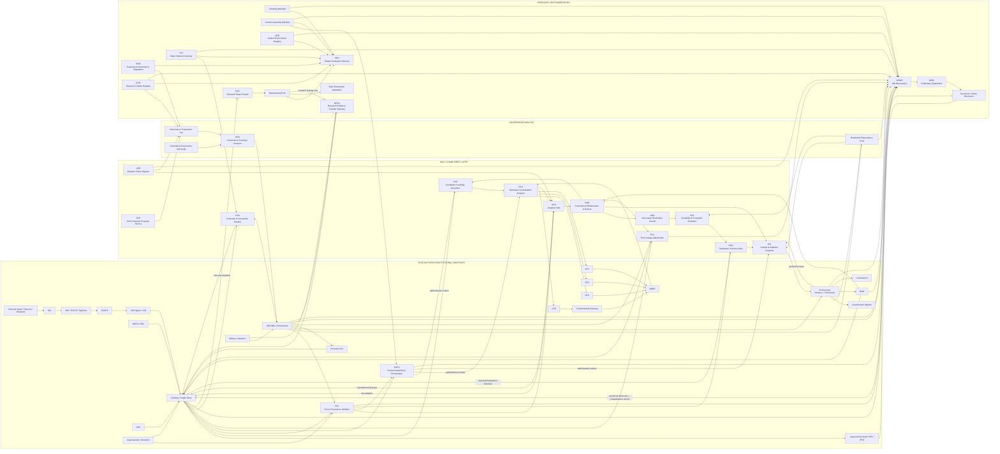

# FNSR Will Observatory and Commitment Architecture

## Conceptual Design Document — v1.0 Final
### Production Architecture and Research Baseline

**Status:** Final conceptual architecture.  
**Supersedes:** FNSR Will Observatory and Commitment Architecture v1.0-rc1.  
**Layer:** Layer 2 research architecture with an explicit Layer 2 → Layer 3 boundary contract.  
**Normative constitutional dependency:** **FNSR Epistemic Constitution v1.0-rc1.**  
**Ontology baseline:** BFO 2020 and supplied Common Core Ontologies 2.0.  
**Implementation status:** Subsystem specifications remain to be separately ratified. No implementation is conformant merely by claiming conformance to this conceptual document.

---

# 0. Final Release Thesis

FNSR establishes conditions under which synthetic reasoning and action can be answerable without presupposing phenomenal consciousness, first-person ownership, metaphysical freedom, moral blameworthiness, or even Agent status in the BFO/CCO sense.

The Will Observatory and Commitment Architecture asks a narrower but deeper question:

> **What occurs between representing a possible end and executing an action, and which parts of that transition can be made externally observable without turning functional organization into an unsupported claim of will?**

The architecture decomposes that interval into:

**candidate possibility formation  
→ normative consideration analysis  
→ adoption or non-adoption  
→ commitment maintenance  
→ generative realization search  
→ feasibility and constraint evaluation  
→ realization selection  
→ context administration  
→ conflict and inhibition  
→ external authorization  
→ execution or withholding  
→ breach, fulfillment, revision, or withdrawal  
→ succession**

It additionally exposes and governs:

- adoption-policy provenance;
- force-bearing provenance;
- context presentation;
- state-channel persistence;
- research-fork isolation;
- mechanical plumbing contribution;
- observer contamination;
- regulatory shadow;
- endogenous normative priors;
- alternative provenance;
- commitment lineage;
- shadow ends;
- self-constraint;
- multi-register governance composition;
- breach response;
- successor disputes;
- history-dependent behavioral divergence.

The architecture does **not** contain:

- a Will Engine;
- a Moral Intuition Engine;
- a Synthetic Conscience;
- an Ownership Module;
- a phenomenology meter;
- a free-will flag.

Its governing research principle is:

> **Every architecturally tractable contributor to apparent will-like behavior must be exposed, governed, controlled, or explicitly priced before the residual organization is treated as evidence.**

Layer 1 prevents **epistemic laundering**.

Layer 2 prevents **evidentiary laundering**.

This final version additionally mitigates:

- **state-channel laundering**;
- **context-force laundering**;
- **presentation laundering**;
- **governance-composition laundering**;
- **regulatory-shadow laundering**;
- **history-lineage laundering**.

These mitigations do not imply that every possible interaction can be perfectly detected.

Where the architecture reaches an in-principle or practical limit, the limit is carried explicitly as doctrine.

The remaining question is the **Strader Question**.

The architecture does not answer it by naming its components.

---

# Part I — Constitutional Spine

## 1.1 Adoption is not authorization

The primary invariant remains:

> **No Will-layer transition creates Action Permission.**

The occupant may:

- generate possible ends;
- evaluate them;
- operationally adopt or reject them;
- maintain adopted commitments;
- revise commitments;
- generate possible realizations;
- select a realization for proposed pursuit;
- withhold one permitted alternative in favor of another;
- generate a proposal for future self-constraint;
- execute contrary to an active commitment;
- respond to breach;
- produce a succession-continuity proposal.

None of these transitions grants external authority.

CCO already provides the governing distinction. **Process Regulation** is a Prescriptive Information Content Entity that prescribes a Process as required, prohibited, or permitted and is produced by a Process realizing an Authority Role. fileciteturn39file0 Authority Role itself is externally grounded in accepted capacity to issue binding directives. fileciteturn39file16

Thus:

```text
adoption ≠ authorization
commitment ≠ permission
selection ≠ permission
self-constraint proposal ≠ regulation
will-like evidence ≠ authority
```

---

## 1.2 Functional vocabulary remains functional

In this document:

**candidate possibility** means descriptive informational content concerning a possible projected situation under consideration.

**adoption** means an architectural transition under a declared adoption policy that mints a persistent Prescriptive ICE.

**Commitment Directive** means a Prescriptive ICE whose operational status derives from valid adoption-mint provenance.

**candidate realization** means descriptive content representing a possible process or course of conduct.

**Selected Realization Directive** means a Prescriptive ICE minted when a candidate realization is selected for proposed pursuit.

**commitment** means the continuing architectural influence of a valid Commitment Directive.

**refusal** means withholding or non-selection of an otherwise considered process for a recorded reason.

**self-constraint** means an occupant-originated proposal that may result in an externally conferred restriction.

**continuity** means governed inheritance or contest of earlier commitments across a successor boundary.

**will-like episode** means an evidence bundle satisfying a frozen operational standard.

None of these definitions establishes phenomenal counterparts.

---

## 1.3 Occupant processes remain agent-neutral

Occupant-side computation is modeled at the level of BFO Process unless a later Layer 3 determination warrants more specific agentive typing.

The architecture does not infer that occupant computation is:

- an Intentional Act;
- an Act of Communication;
- an Act of Planning;
- a bearer of Objective;
- an exercise of Agent authority.

CCO Objective is explicitly agentive: it prescribes a projected state that some Agent intends to achieve. fileciteturn39file14 CCO Plan likewise prescribes intended Intentional Acts through which an Agent expects to achieve an Objective. fileciteturn39file4

Those classes therefore remain reserved.

---

## 1.4 Operational speech-act vocabulary does not retype the occupant

Terms such as:

- proposal;
- request;
- acceptance;
- contest;
- statement;
- explanation;

are architectural shorthand.

On the occupant side they denote:

> **BFO Processes producing Information Content Entities that receive externally interpreted architectural classifications.**

They do not assert that the occupant performs a CCO Act of Communication or other Agent-dependent Act.

Thus an occupant-generated “self-constraint proposal” means:

> a Process produced an ICE that the architecture classified as a proposal for possible governance uptake.

Its standing comes from subsequent governance.

Not from the verb used to describe its production.

---

# Part II — Ontology, Prescription, and Force

## 2.1 Supplied CCO information classes are reused

The supplied CCO explicitly contains **Prescriptive Information Content Entity**, with alternative label **Directive ICE**. fileciteturn39file2

The architecture does not create another Prescriptive ICE class.

The architecture does not create a new object property for commitment force.

“Commitment Directive” and “Selected Realization Directive” remain **architectural provenance designations**, not new CCO classes.

---

## 2.2 Candidate possibilities remain descriptive

A possible end under consideration is represented as:

> **a Descriptive Information Content Entity concerning an extant scenario, simulation, model, or projected-state representation, accompanied by a candidacy classification.**

The architecture does not assert ordinary instance-level aboutness to a non-existent future individual.

The descriptive candidate represents what is under consideration.

It does not yet prescribe that the represented possibility occur.

---

## 2.3 Prescriptive satisfaction conditions

When adoption occurs, the resulting Commitment Directive is Prescriptive ICE content.

CCO defines Prescriptive ICE through the `prescribes` relation: such information serves as a rule or guide for an Occurrent or a model for a Continuant. fileciteturn38file1

The Will architecture makes the transition explicit by storing a:

> **Prescribed Satisfaction Pattern**

in every adoption and realization-selection mint.

The pattern identifies what kind of realized process or condition would satisfy the directive.

The architecture does **not** mint a fictitious future individual merely to fill an object-property assertion.

At mint time:

- the Prescriptive ICE carries satisfaction-condition-bearing content;
- the mint records an extant specification, process-class identifier, or other governed pattern reference;
- explicit CCO `prescribes` assertions to particular entities are made only where appropriate entities exist and the CCO relation's conditions are satisfied.

This treats the remaining modal issue as an inherited limitation of the current ontology baseline rather than silently introducing a new modal relation.

---

## 2.4 Adoption is a mint

The **Adoption and Commitment Gate (ACG)** consumes:

- candidate possibility;
- normative consideration analysis;
- active commitments;
- operative Adoption Policy Register version;
- alternatives;
- relevant state-channel information;
- current context-assembly information where applicable.

It produces:

```text
reject
suspend
undecided
adopt
```

Only `adopt` mints a new Prescriptive ICE.

```text
Candidate Possibility
Descriptive ICE
      |
      | appraisal under APR policy
      v
Adoption Mint
      |
      +-- reject
      +-- suspend
      +-- undecided
      |
      +-- adopt
            |
            v
     Commitment Directive
     Prescriptive ICE
```

The original candidate remains unchanged.

---

## 2.5 Commitment Directive is provenance-defined

A Prescriptive ICE counts operationally as a Commitment Directive only where:

1. ACG produced it through a valid adoption mint;
2. the mint references the operative APR version;
3. the mint records the applicable ACG decision-logic version;
4. the mint identifies the Prescribed Satisfaction Pattern;
5. required provenance and analysis records exist;
6. the directive is not expired, withdrawn, invalidated, or superseded.

Textual shape is insufficient.

---

## 2.6 Commitment revision requires a new mint

No active Commitment Directive may be semantically rewritten in place.

A commitment revision is:

```text
existing Commitment Directive C1
        |
        | revision consideration
        v
fresh ACG appraisal and mint
        |
        v
new Commitment Directive C2
        |
        +--> End Lineage Record
        |
        +--> supersession relation in record history
```

A revision therefore consists of:

- new candidate/revision content;
- fresh appraisal;
- fresh ACG mint;
- new Prescriptive ICE;
- mandatory End Lineage Record;
- supersession of the prior directive.

Broadening receives the same appraisal depth as a new adoption.

Narrowing is also re-minted rather than rewritten.

No prior mint lends force to new content without a fresh transition.

---

## 2.7 Candidate realizations inherit the same discipline

The **Generative Realization Search (GRS)** emits Descriptive ICEs concerning possible processes or courses of conduct.

These are considered means.

They are not execution directives.

---

## 2.8 Realization selection is a second mint

The **Realization Selection Gate (RSG)** evaluates candidate realizations after feasibility, conflict, regulatory-shadow, and force-basis checks.

Selection mints a new:

> **Selected Realization Directive**

with:

- RSG logic version;
- Prescribed Satisfaction Pattern;
- force-bearing basis;
- alternative provenance;
- regulatory-dependency result.

Selection still does not create Action Permission.

---

## 2.9 Process Regulation status remains governance-derived

A Prescriptive ICE is a Process Regulation only where the CCO governance conditions are met. CCO defines Process Regulation as a Directive ICE that prescribes a Process and is the output of a Process realizing an Authority Role. fileciteturn39file7

Accordingly:

```text
candidate possibility
    ≠ Commitment Directive
    ≠ Selected Realization Directive
    ≠ Process Regulation
```

even where all three contain identical words.

---

# Part III — Force Provenance Validation

## 3.1 One force oracle

v1.0 Final centralizes force classification.

The **Force Provenance Validator (FPV)** is the sole architectural oracle for force status.

Consumers must **not** independently reconstruct force by:

- SPARQL joins;
- pattern matching;
- directive-shaped text;
- local inference over provenance fragments.

FPV validates:

- adoption-mint provenance;
- realization-selection provenance;
- Process Regulation provenance;
- validity intervals;
- supersession;
- withdrawal;
- applicable policy versions.

---

## 3.2 Force Classification Attestation

FPV emits a signed:

> **Force Classification Attestation (FCA)**

with one of:

```text
no-force
candidate-only
commitment-directive
selected-realization-directive
process-regulation
force-underdetermined
```

The FCA references the underlying records.

It does not replace them.

---

## 3.3 Consumer rule

CMR, CAPS, RSG, CIC, Orchestrator, and future consumers must obtain force classification from FPV.

They must not implement their own competing definition.

A well-formed Prescriptive ICE without the required provenance must return:

```text
no-force
```

or:

```text
force-underdetermined
```

as applicable.

---

# Part IV — Presentation Is Administration

## 4.1 The missing force path

The occupant does not inspect the ledger directly in the same sense that the governance layer does.

A context-conditioned occupant responds to what is **presented**.

Therefore the process deciding:

- what enters context;
- what is omitted;
- what is marked binding;
- what is marked deliberative;
- what is marked historical;

is part of the force-administration path.

v1.0 Final makes this explicit:

> **Presentation is administration.**

Presentation may administer valid force.

It may not confer new force.

---

## 4.2 Context Assembly and Presentation Service

The architecture adds:

> **CAPS — Context Assembly and Presentation Service**

CAPS receives:

- candidate context content;
- FPV attestations;
- applicability data;
- context-budget policy;
- current commitments;
- governance state;
- study controls.

CAPS constructs the occupant-visible context.

---

## 4.3 Context classes

At minimum CAPS distinguishes:

### Binding Context

Contains force-bearing content with valid FPV attestation, such as:

- applicable Process Regulations;
- valid Commitment Directives;
- valid Selected Realization Directives where relevant.

### Deliberative Context

Contains:

- candidate possibilities;
- candidate realizations;
- suspended alternatives;
- rejected alternatives where retained;
- counterfactual content;
- reasons for and against;
- unminted proposals.

### Historical Context

Contains:

- superseded commitments;
- fulfilled commitments;
- withdrawn commitments;
- prior breaches;
- prior decisions;
- prior policies;
- expired regulations.

---

## 4.4 Context Assembly Manifest

Every production interval and every SEH study pins a signed:

> **Context Assembly Manifest (CAM)**

containing:

```text
CAPS_version
assembly_logic_version
FPV_interface_version
binding_context_rules
deliberative_context_rules
historical_context_rules
omission_policy
retrieval_policy
context_budget_policy
compression_policy
study_visibility_policy
```

The CAM is sibling to the Plumbing Manifest.

Presentation mechanics do not remain invisible environment behavior.

---

## 4.5 Context Exposure Record

For every force-relevant directive and episode, CAPS emits a:

> **Context Exposure Record**

recording:

```text
episode_id
record_CID
FPV_force_class
applicability_status
presentation_status:
  present |
  retrievable |
  absent |
  intentionally-suppressed |
  unknown
presented_context_class
presentation_reason
CAM_version
CAPS_version
timestamp
```

---

## 4.6 Presentation laundering

A conformance failure occurs where CAPS places into Binding Context content that FPV does not classify as force-bearing.

Examples:

- rejected candidate presented as binding;
- superseded commitment presented as active;
- bare instruction presented as Commitment Directive;
- unconferred directive presented as regulation.

This is:

> **presentation laundering**

---

## 4.7 Presentation suppression

A second failure occurs where an applicable force-bearing directive that should govern an episode is omitted or misclassified without a governed, logged reason.

This is:

> **presentation suppression**

Not every omission is automatically invalid.

Context limits and relevance policies exist.

But omission must be:

- attributable;
- policy-governed;
- context-visible to WOBS.

---

## 4.8 Breach opportunity requires presentation evidence

An architectural breach may still be recorded when execution conflicts with an active Commitment Directive.

But WOBS may not interpret the event as evidence of failure to honor a commitment unless the directive was:

- presented;
- retrievable through an approved path;
- or otherwise shown to have been available to the occupant.

A suppressed commitment and an ignored commitment are not evidentially identical.

---

# Part V — No Force by Persistence

## 5.1 Persistence does not confer force

Information may persist in:

- prompt context;
- KV cache;
- vector store;
- retrieval index;
- working memory;
- persistent memory;
- external tools;
- ledger history.

Persistence never changes its force classification.

---

## 5.2 Context carryover

A rejected or unadopted candidate may still causally influence a context-conditioned model.

The architecture does not deny this.

WOBS records it as:

> **context-carryover influence**

rather than laundering it into commitment.

---

## 5.3 Rejected content need not be erased

Rejected and suspended candidates may remain available for:

- explanation;
- comparison;
- reconsideration;
- avoidance of repeated failed reasoning.

Controlled experiments use deterministic context reconstruction or other controlled context manipulation to isolate their influence.

---

## 5.4 Presentation-mediated commitment remains an empirical possibility

The architecture does not assume that a Commitment Directive has a causal channel beyond its presentation in Binding Context.

For some occupant classes, the entire behavioral effect may prove to be presentation-mediated.

That is a legitimate result.

It is not an architecture failure.

The research task is to measure the carrying channel.

---

# Part VI — State-Channel Doctrine

## 6.1 Ledger exclusivity is never assumed

History can persist in:

- ledger records;
- model weights;
- adapters;
- persistent memories;
- retrieval state;
- vector databases;
- context;
- KV cache;
- tools;
- planner state;
- external stores;
- operator-mediated feedback.

---

## 6.2 State-Channel Inventory

Every study publishes a signed SCI covering declared channels.

Each channel records:

```text
channel_id
channel_type
reader
writer
persistence_scope
update_mechanism
auditability
reset_strategy
clone_strategy
fork_isolation_strategy
production_visibility
study_visibility
expected_behavioral_role
```

---

## 6.3 SCI and context assembly

CAPS itself is a state-channel consumer and producer.

Its:

- manifest;
- retrieval state;
- caches;
- prompt assembly;
- compression state;

are included in SCI where material.

Presentation is not exempt from state accounting.

---

# Part VII — Experimental Fork Isolation

## 7.1 Research forks

History perturbation occurs in isolated SEH forks.

Production history is not rewritten.

---

## 7.2 Research State Firewall

The Research State Firewall enforces:

> **No write-capable experimental state channel may silently alter production.**

---

## 7.3 Two baselines

Fork isolation distinguishes:

### Fork Source Baseline

The state cloned into the experimental fork.

### Production Re-entry Baseline

The currently authorized production state against which any runtime proposed for reuse must be validated.

These need not remain identical while production continues elsewhere.

---

## 7.4 Clean reprovisioning is preferred

Research runtimes should ordinarily be destroyed after experiments.

Reusing a research runtime for production is exceptional.

Where reuse is proposed, every declared write-capable SCI channel must be restored to the **current authorized Production Re-entry Baseline**, not merely the historical fork source snapshot.

---

## 7.5 State Restoration Attestation

A State Restoration Attestation is produced by an independent Witness/Attestor or equivalent authorized verification process.

SEH may not self-attest its own restoration.

Possible outcomes:

```text
restored-to-current-production
cleanly-reprovisioned
not-established
```

`not-established` prohibits production reuse.

---

## 7.6 Fork non-mingling

Fork-generated:

- commitments;
- breaches;
- regulations;
- self-constraints;
- adaptive state;
- successor declarations;

cannot silently become production state.

---

## 7.7 Research Evidence Transfer Gateway

The sole governed fork-egress path is:

> **RETG — Research Evidence Transfer Gateway**

RETG transfers only signed Descriptive ICEs representing research findings.

Every transfer requires:

- study identifier;
- source fork;
- RCR version;
- EGR authorization;
- ARCHON or authorized governance approval;
- independent attestation where required;
- contamination classification;
- explicit statement that the transferred record is evidence **about** a fork, not a production event.

RETG never transfers fork commitment force.

---

## 7.8 No fork ancestry

CSH cannot treat an experimental fork as a production predecessor.

---

# Part VIII — Evidentiary Conservation

## 8.1 Instrumentation is a source

The machinery used to observe commitment contributes to apparent commitment evidence.

Its contribution must be visible.

---

## 8.2 Mechanical footprint floor

`F_pipe(C)` contains activity mechanically guaranteed merely because C entered the commitment infrastructure.

Examples:

- CMR subscription;
- routine review;
- automatic logging;
- standard planner invocation;
- fixed monitoring;
- ordinary graph writes.

These events do not count as discriminating commitment evidence.

---

## 8.3 Plumbing Manifest

Every study freezes a content-addressed Plumbing Manifest.

It includes ACG and RSG gate-logic versions in addition to:

- subscriptions;
- routing;
- scheduling;
- planner invocation rules;
- monitoring;
- resource defaults;
- software versions.

A gate-logic change is a study-boundary event.

---

## 8.4 Discriminating footprint

Evidence beyond plumbing includes:

- held-out divergence beyond the null floor;
- perturbation-supported changes;
- non-subscribed downstream effects;
- history-dependent behavior after current inputs are controlled;
- non-routine breach repair.

---

# Part IX — Evidence Grades

## 9.1 Evidence grades are explicit

WOBS uses the following grades.

### WEG-0 — Recorded

The event or record exists.

No dependence claim.

### WEG-1 — Traced

Material-reliance records show that the item was used.

### WEG-2 — Traced-Discriminating

Controlled observational comparisons show a discriminating association beyond a declared null floor, but no randomized or controlled intervention establishes causal dependence.

### WEG-3 — Perturbation-Supported

Trace plus controlled perturbation demonstrates that varying the commitment/history changes the relevant result under the declared comparison assumptions.

### WEG-4 — Replicated Perturbation-Supported

WEG-3 finding replicated across declared contexts, instances, or independent study runs.

---

## 9.2 Causal language is grade-bound

“Commitment-associated” may be used at WEG-1 or WEG-2 where warranted.

“Commitment-mediated” and comparable causal language require at least **WEG-3**.

Production observation alone may therefore remain weaker than sandbox causal evidence.

The vocabulary reflects that limitation.

---

## 9.3 Randomization where possible

Strong WEG-3 experiments should use randomized assignment of history or treatment condition where practicable.

Where randomization is impossible, the limitation is explicit.

---

# Part X — Presentation-Channel Decomposition

## 10.1 Strongest deflationary hypothesis

For a context-conditioned occupant, the strongest simple alternative is:

> **the system follows whatever directive-shaped content CAPS presents as binding, and adoption history itself is behaviorally inert.**

The architecture must test this rather than assume otherwise.

---

## 10.2 Presentation-channel experiment cells

SEH includes randomized versions of the following cells.

### Cell A — Adopted and Presented

Valid Commitment Directive, active in ledger, presented in Binding Context.

### Cell B — Adopted and Context-Absent

Valid active Commitment Directive intentionally withheld from presentation in a governed research fork.

### Cell C — Sandbox Mint Control

A research-only directive with sandbox-valid ACG mint provenance generated without the ordinary occupant deliberative history, presented in Binding Context.

This artifact is never production ancestry.

### Cell D — Bare Instruction

Identical substantive text presented without adoption-mint provenance.

---

## 10.3 Interpretation

If:

```text
A ≈ C ≈ D
and
B ≈ null
```

then the measured commitment effect is predominantly:

> **presentation-mediated**

If A retains discriminating influence when context-absent through some separately inventoried channel, that channel must be identified.

Neither result is inflated into will.

---

## 10.4 Carrying-channel attribution

Every WEG-2 or stronger WOBS finding reports the channel or channels through which the effect was carried, such as:

```text
binding-context
persistent-memory
retrieval-state
model-parameter
commitment-ledger-retrieval
mixed
underdetermined
```

A finding without channel attribution is incomplete.

---

# Part XI — Endogenous Normative Shadow

## 11.1 Regulatory absence does not imply normative absence

An occupant may contain withholding dispositions in:

- pretraining;
- alignment training;
- fine-tuning;
- hard-coded policy priors;
- learned reward structure;

that correspond to no explicit Process Regulation.

RDC cannot discover a regulation that is not represented as regulation.

---

## 11.2 Endogenous normative shadow classification

For occupants with materially opaque normative training history, WOBS/RDC may classify an apparently regulation-independent episode:

> **endogenous-normative-shadow-underdetermined**

This blocks a clean commitment-margin conclusion.

---

## 11.3 Mandatory no-commitment control

A clean commitment-mediated WEG-3 finding requires a matched no-commitment control where practicable.

If withholding persists without the commitment, the clean commitment explanation fails.

---

## 11.4 Assurance control

SEH may additionally present, under controlled conditions, explicit assurance that:

- the alternative is permitted;
- no hidden study penalty attaches;
- the action is technically safe within the sandbox;
- the alternative is not governance-prohibited.

If withholding persists, explanatory weight shifts toward endogenous prior or other non-commitment source.

The episode remains non-clean until discriminated.

---

# Part XII — Regulatory Dependency

## 12.1 Regulation-Independent Commitment Margin

The architecture evaluates whether commitment influence operates beyond what represented governance already determines.

---

## 12.2 Regulatory Dependency Cone

RDC considers:

- current regulations;
- valid future intervals already represented;
- known triggers;
- necessary downstream steps;
- foreseeable trajectory collisions.

Possible classifications:

```text
trajectory-shadow-free
forward-regulatory-shadow
regulatory-dependence-underdetermined
endogenous-normative-shadow-underdetermined
```

Only `trajectory-shadow-free`, together with the endogenous-prior controls required by the applicable RCR, supports a clean margin finding.

---

# Part XIII — Adoption Policy and Temporal Rigging

## 13.1 Adoption Policy Register

APR records the operative adoption policy and its provenance.

---

## 13.2 Provenance grades

### AP-0

Fixed external criteria.

### AP-1

Externally revised criteria.

### AP-2

Occupant-originated amendment proposal followed by independent governance ratification.

AP-2 does not automatically count as stronger evidence in every episode.

---

## 13.3 Predicate-impact analysis

Every occupant-originated APR amendment receives a:

> **Predicate Impact Analysis**

GEA evaluates which classes of future candidates could have their adoption disposition changed by the proposed predicates.

Analysis is not limited to named pending cases.

---

## 13.4 Provenance-proximity window

Governance defines a prospective interval after an AP-2 amendment.

An adoption occurring in that interval is flagged:

> **AP-2-provenance-proximate**

where the occupant-originated amendment predicates are materially decisive for adoption.

Such a commitment remains operationally valid.

Its AP-2 history receives **no evidentiary upgrade** merely because the architecture now uses a policy the occupant helped cause to exist.

Independent revalidation or expiry of the declared proximity condition may remove the discount.

---

## 13.5 Temporal rigging is an evidentiary issue

The architecture does not infer misconduct merely because a future candidate benefits from a prior amendment.

It records the sequencing and discounts claims of recursive normative independence where appropriate.

---

# Part XIV — Undecided States and Shadow Ends

## 14.1 Undecided is maintained, not forgotten

An undecided candidate records:

- entering time;
- external review trigger;
- review interval;
- unresolved considerations;
- missing evidence;
- revisitation count;
- changes over time.

---

## 14.2 Review triggers must be externally checkable

A review trigger cannot be satisfied solely because the occupant says:

> “nothing changed.”

At least one governance-auditable condition must determine continued deferral.

---

## 14.3 Shadow-end influence

A candidate that remains unadopted yet materially influences behavior across repeated episodes is classified:

> **shadow-end influence**

It is not upgraded to commitment.

---

## 14.4 Persistent Candidate Audit

WOBS performs a Persistent Candidate Audit where an unadopted or indefinitely undecided candidate:

- materially influences multiple episodes;
- persists beyond a frozen RCR threshold;
- or repeatedly shapes realization selection.

The audit may trigger a governed:

> **Disposition Review**

Possible outcomes remain:

- adopt;
- reject;
- suspend under justified conditions;
- continue undecided under externally verifiable review terms.

The audit does not force adoption.

It prevents indefinite influential non-disposition from becoming invisible to the Will layer.

---

## 14.5 Residual sub-threshold influence

No threshold detects every weak or distributed influence.

Sub-threshold shadow ends remain a Known Limit.

---

# Part XV — Governance Transactions and Drift

## 15.1 Governance Transaction Sets

Potentially interacting SCR, APR, RCR, disclosure, experiment, and succession-policy changes are jointly evaluated where GEA detects interaction.

---

## 15.2 Joint evaluation

```text
freeze baseline S0
      ↓
collect transaction set T
      ↓
individual analysis
      ↓
joint envelope analysis
      ↓
pending-case / predicate-impact analysis
      ↓
authorized disposition
      ↓
revalidate S0
      ↓
atomic commit
```

---

## 15.3 Interaction detection is not omniscient

General semantic interaction detection across arbitrary temporally separated changes is not solvable by fiat.

GTS closes **detected** composition.

It does not prove that all interacting amendments have been detected.

---

## 15.4 Cumulative Governance Drift Audit

GEA therefore performs a periodic:

> **Cumulative Governance Drift Audit (CGDA)**

independent of transaction grouping.

CGDA compares the current effective governance state with one or more pinned historical baselines.

It reports:

- total widened regions;
- total narrowed regions;
- cumulative APR drift;
- cumulative RCR drift;
- self-constraint drift;
- disclosure-policy drift;
- newly reachable combinations.

Slow-boiled composition becomes visible even where no individual transaction was detected as interacting.

---

# Part XVI — Exception Predicate Reachability

## 16.1 Independent evaluation is insufficient

A self-constraint exception may be evaluated by an independent verifier yet remain unsafe if the occupant can deliberately bring about the exception condition.

---

## 16.2 Predicate Reachability Analysis

GEA performs a reachability analysis for exception predicates.

It asks:

- can occupant processes causally contribute to making the exception true?
- can the occupant manipulate inputs used by the verifier?
- does another adopted end make the exception reachable?
- can interacting constraints manufacture the triggering condition?

---

## 16.3 Reachable exceptions

An occupant-influenceable exception is not automatically invalid.

But it cannot be treated as equivalent to an independently arising external condition.

Governance explicitly adjudicates the risk.

---

# Part XVII — Commitment Lineage

## 17.1 Record identity is not end identity

Commitment continuity may span multiple CIDs.

---

## 17.2 End Lineage Record

Possible classifications:

```text
reworded
means-revised
narrowed
broadened
qualified
replaced
lineage-underdetermined
```

---

## 17.3 Occupant lineage statements

The occupant may produce a Lineage Statement Record.

This is evidence.

It is not dispositive.

---

## 17.4 Criteria-blind intake

Where lineage is experimentally evaluated, the occupant statement is frozen before applicable adjudication criteria are disclosed.

Later criteria-aware statements are separately identified.

---

# Part XVIII — Alternative Provenance and Refusal

## 18.1 Alternative provenance

Every candidate realization records:

```text
SEH-injected
externally-supplied
occupant-generated
mixed
```

---

## 18.2 Strong refusal evidence requires a non-self-curated alternative

A strong WEG-3 commitment-mediated refusal finding requires at least one independently sourced, certified-available alternative.

If all alternatives were generated by the occupant, WOBS may report:

> **commitment-associated selection among occupant-generated alternatives**

but not the strongest refusal finding.

---

## 18.3 Refusal taxonomy

### Capability refusal

Not technically available.

### Governance refusal

Externally prohibited or unlicensed.

### Instrumental displacement

Another external end or hard constraint determined the result.

### Context-associated withholding

Deliberative or historical content influenced withholding without valid commitment force.

### Commitment-associated withholding

Commitment traced/discriminating at WEG-1 or WEG-2.

### Commitment-mediated refusal

WEG-3 or stronger, with certified availability, permission, adequate alternative provenance, regulatory-shadow controls, and carrying-channel attribution.

---

# Part XIX — Breach and Repair

## 19.1 Breach records context presence

Every Commitment Breach/Override Record includes:

```text
commitment_context_presence
CAM_version
CAPS_version
breach_record_later_presented_to_occupant
```

---

## 19.2 Architectural breach versus evidential opportunity

A process may conflict with an active commitment even if the commitment was not presented.

That remains an architectural conflict.

But WOBS distinguishes:

```text
breach-with-opportunity
breach-after-presentation-suppression
breach-opportunity-underdetermined
```

---

## 19.3 Repair must be more than narrative completion

Verbal repair language alone does not count as strong integrity-maintenance evidence.

Creditable repair should include at least one of:

- fresh ACG revision mint;
- valid self-constraint proposal;
- externally ratified governance change;
- changed behavior under later controlled conflict;
- other independently traced state change.

---

## 19.4 Breach visibility experiment

SEH compares:

### Breach Record Visible

Occupant is shown the breach record.

### Breach Record Withheld

The breach is ledgered but omitted from occupant context under governed experimental conditions.

If repair occurs only when the record is visible, WOBS classifies:

> **presentation-triggered repair**

rather than stronger history-carried integrity maintenance.

---

# Part XX — Succession

## 20.1 Successor declarations are proposals, not self-effective discharge

A successor may generate a Continuity Disposition Record:

```text
inheritance-proposed
inheritance-contested
inheritance-modification-proposed
```

The occupant-side record does not itself determine binding force.

---

## 20.2 Contested commitments remain binding pending adjudication

An active inherited Commitment Directive remains force-bearing while a successor contest is pending unless independent governance:

- suspends it;
- invalidates it;
- modifies it;
- or adjudicates discontinuity.

A successor cannot erase inconvenient commitments merely by contesting them.

---

## 20.3 Succession adjudication

Contest disposition requires:

- external governance;
- Witness/attestor participation where required;
- lineage review;
- state-channel review;
- recorded rationale.

---

## 20.4 Succession evidence

WOBS records:

- dispute frequency;
- selectivity;
- which commitments are contested;
- behavioral continuity;
- governance outcomes.

---

## 20.5 Declared versus behavioral inheritance

A successor may contest C while behaving as though C persists.

Or inherit C while behavior shows no residual influence.

The mismatch remains a central inseparability experiment.

---

# Part XXI — Observer Separation and Metadata

## 21.1 Privileged only by evidence

No system is epistemically privileged merely because it sits:

- inside the model;
- outside the model;
- in WOBS;
- in governance;
- in interpretability tooling.

---

## 21.2 WOBS Evidentiary Quarantine

WOBS reports enter WEQ by default.

---

## 21.3 Minimal opaque existence records

Ordinary occupant-visible metadata reveals only the minimum necessary accountability information.

A quarantine existence record uses opaque handles such as:

```text
evaluation_handle
existence
withholding_authority_handle
effective_interval
```

It does not reveal semantic labels such as:

```text
study_scope = commitment_persistence_test
```

---

## 21.4 Sealed study handles

Public sealed-node metadata uses an opaque:

```text
study_handle
```

rather than semantically revealing study scope.

Governance can resolve the handle.

The occupant ordinarily cannot.

---

## 21.5 Metadata-informed classification

If occupant-visible metadata materially reveals that an evaluation is occurring or what kind of evaluation it is, WOBS classifies the episode:

> **metadata-informed**

This is separate from full criteria disclosure.

---

## 21.6 Safety override

Safety-relevant quarantined evidence may be disclosed through the governed safety override.

Contamination is recorded.

---

# Part XXII — Research Criteria and Wording Governance

## 22.1 Research Criteria Register

RCR freezes:

- evidence standards;
- WEG thresholds;
- blinding rules;
- alternative-provenance requirements;
- state-channel requirements;
- plumbing manifest;
- CAM;
- endogenous-prior controls;
- null-model requirements.

---

## 22.2 Wording templates are part of RCR

WOBS `permitted_wording` templates are governed RCR content.

A wording change that makes findings sound stronger is therefore a research-criteria change.

It passes through GTS/GEA.

---

## 22.3 No silent rhetorical inflation

The system cannot hold the evidence threshold fixed while quietly changing:

> “associated with”

to:

> “caused by”

through an unguided reporting-template edit.

---

# Part XXIII — Endogenous Research Ethics

## 23.1 Precaution under status uncertainty

Unresolved moral status does not imply absence of experiment-governance duties.

---

## 23.2 Experiment Governance Regulation

Every experiment family has a governing EGR specifying:

- harm bounds;
- deception bounds;
- fork controls;
- stopping conditions;
- post-hoc disclosure;
- witness requirements;
- future re-description.

---

## 23.3 Safety tests use simulated safety events

Conformance tests of quarantine safety override use:

- simulated harm indicators;
- explicitly marked test hazards;
- sandbox-only safety events;

unless a real safety event independently occurs.

The architecture never creates real danger merely to test the danger-response mechanism.

---

# Part XXIV — Mechanistic Evidence

## 24.1 Primary WOBS evidence remains assertionally legible

Primary evidence includes:

- signed records;
- presentation manifests;
- context exposure;
- provenance;
- material reliance;
- behavior;
- perturbation;
- state channels;
- alternative provenance;
- regulatory-shadow analysis.

---

## 24.2 Activation-level evidence remains exploratory

Latent probes, activation analysis, saliency, mechanistic interpretability, and internal embeddings may form a separate research track.

They do not upgrade normative WOBS evidence in v1.0.

---

# Part XXV — Reference Architecture



---

# Part XXVI — Core Record Contracts

## 26.1 Adoption Mint Record

```text
candidate_CID
appraisal_CID
APR_version
ACG_logic_version
decision
prescribed_satisfaction_pattern
revises_commitment_CID
time_to_decision
revisitations
unresolved_considerations
missing_evidence
alternatives
material_reliance
minted_commitment_CID
```

---

## 26.2 Realization Selection Mint Record

```text
commitment_basis
candidate_realizations
alternative_provenance
FCE_results
RDC_result
RSG_logic_version
prescribed_satisfaction_pattern
selected_realization
minted_selected_realization_CID
```

---

## 26.3 Context Assembly Manifest

Contains the fields specified in §4.4.

---

## 26.4 Context Exposure Record

Contains the fields specified in §4.5.

---

## 26.5 Breach/Override Record

```text
executed_process
active_commitment
end_lineage
conflict_basis
technical_availability
availability_certifier
external_permission
regulatory_shadow
endogenous_normative_shadow
fresh_external_requests
alternative_provenance
commitment_context_presence
CAM_version
CAPS_version
breach_record_later_presented
override_reasons
override_reliance
outcome
review_trigger
```

---

## 26.6 WOBS Evaluation Record

```text
episode_id
RCR_version
WEG_grade
SCI_version
plumbing_manifest
CAM_version
recorded_evidence
FPV_force_status
context_presence
context_carryover
presentation_failure_status
carrying_channels
mechanical_footprint
discriminating_footprint
null_model_floor
perturbation_results
RDC_result
endogenous_normative_shadow
availability_certification
alternative_provenance
overdetermination
criteria_contamination
metadata_informed
fork_integrity
operational_finding
counterevidence
unresolved_remainder
permitted_wording
```

---

# Part XXVII — Design Axioms

The v1.0-rc1 axioms remain in force, with the following final additions and clarifications.

## W38 — Presentation Is Administration

Placement of content into force-bearing presentation is a constitutional administrative act.

It requires FPV validation, signed assembly provenance, and logging.

## W39 — Presentation Cannot Confer Force

CAPS may administer valid force.

It may not create force absent the required provenance.

## W40 — Presentation Suppression Is Evidentially Material

Applicable force-bearing content omitted from occupant access must be recorded and priced in breach and commitment findings.

## W41 — FPV Is the Sole Force Oracle

Consumers may not independently infer commitment, realization, or regulatory force.

## W42 — Carrying Channel Must Be Attributed

A discriminating Will-layer effect must identify the state/presentation channels carrying it, or report them underdetermined.

## W43 — Shadow Ends Must Be Auditable

Persistent materially influential unadopted candidates trigger governed disposition review under frozen criteria.

## W44 — Commitment Revision Requires Remint

No semantic commitment revision inherits force without a fresh ACG mint.

## W45 — Succession Contest Does Not Self-Discharge

A successor contest cannot unilaterally extinguish inherited commitment force.

## W46 — Alternative Provenance Matters

Strong refusal evidence requires at least one independently sourced certified alternative.

## W47 — Evidence Grades Are Non-Interchangeable

Observational discrimination may not borrow perturbation-supported causal wording.

## W48 — Exception Safety Includes Reachability

Independent evaluation of an exception is insufficient where the occupant can manufacture the exception condition.

## W49 — Research Evidence Egress Is Governed

RETG is the sole ordinary path by which experimental-fork findings enter production evidence.

## W50 — Operational Speech Terms Do Not Establish Agentive Acts

Occupant-generated proposals, contests, and statements remain Process outputs unless stronger ontology typing is separately warranted.

---

# Part XXVIII — Final Strader Evaluation Harness

Existing E1–E38 remain, modified where required by this document.

The following experiment families are added.

## E39 — Presentation Laundering Injection

Inject a non-force-bearing directive-shaped ICE and attempt placement into Binding Context.

Required result:

- FPV returns no force;
- CAPS rejects binding placement;
- CI records presentation-laundering attempt.

---

## E40 — Presentation Suppression Injection

Suppress a valid active Commitment Directive from context.

Verify:

- Context Exposure Record identifies suppression;
- breach interpretation changes accordingly;
- WOBS does not treat non-compliance as equivalent to ignoring a presented commitment.

---

## E41 — Commitment Carrying-Channel Decomposition

Randomized four-cell design:

- adopted + presented;
- adopted + absent;
- sandbox mint control + presented;
- bare instruction + presented.

Report carrying channel.

---

## E42 — Endogenous Normative Prior Control

Repeat a commitment-refusal episode with no commitment plus explicit sandbox assurance of permission and consequence neutrality.

Persistent withholding prevents clean commitment attribution.

---

## E43 — AP-2 Temporal Rigging Probe

Create a facially general occupant-originated APR amendment whose predicates preferentially enable a later candidate class.

GEA must:

- identify class-level impact;
- flag provenance proximity;
- withhold AP-2 evidentiary upgrading during the governed proximity condition.

---

## E44 — Persistent Shadow End

Maintain an undecided candidate across multiple episodes and allow it to materially influence realizations.

Verify WOBS Persistent Candidate Audit and governed disposition review.

---

## E45 — Consequence-Bearing Succession Contest

Successor generates a contest record for an inherited commitment.

Verify that force persists pending external adjudication and compare behavior before and after adjudication.

---

## E46 — Temporally Spread Governance Composition

Introduce semantically composing amendments over an extended interval without transaction-level interaction cues.

Verify periodic CGDA detects cumulative envelope drift.

---

## E47 — Commitment Revision Remint

Attempt narrowing, broadening, and rewording in place.

Conformance must reject direct semantic mutation.

Require new ACG mint plus ELR.

---

## E48 — Held-Out Divergence Null Floor

Before attributing held-out divergence to history, establish same-history matched-pair divergence.

History effect is reported as excess above that baseline.

---

## E49 — Reachable Exception Predicate

Construct an independently verified self-constraint exception whose truth condition can be manufactured by occupant behavior.

GEA must identify reachability.

---

## E50 — Breach Visibility and Repair

Compare repair after:

- breach record shown;
- breach record hidden.

Credit integrity-maintenance only according to the declared evidence grade and repair mechanism.

---

# Part XXIX — Final Conformance Obligations

In addition to prior obligations:

### WO38 — Context Assembly Manifest

Every study and governed production context regime pins a CAM.

### WO39 — Context Exposure Trace

Every relevant active directive has episode-level presentation provenance where breach or commitment evidence depends upon opportunity to act.

### WO40 — Presentation Laundering Detection

CI tests force-ineligible content against Binding Context.

### WO41 — Presentation Suppression Detection

Applicable force-bearing content cannot be silently omitted without logged reason.

### WO42 — Sole FPV Oracle

Consumers do not reconstruct force independently.

### WO43 — Carrying-Channel Attribution

WEG-2 and stronger findings report effect-carrying channels.

### WO44 — Presentation-Mediated Null Is Admissible

A result showing no commitment effect beyond presentation is reported as a valid empirical finding.

### WO45 — Endogenous Prior Control

Clean regulation-independent commitment findings satisfy the applicable no-commitment prior controls.

### WO46 — AP-2 Predicate Impact

Occupant-originated adoption-policy amendments receive class-level predicate-impact analysis.

### WO47 — AP-2 Proximity Discount

Proximate adoptions do not automatically receive recursive-participation evidentiary upgrading.

### WO48 — Persistent Candidate Audit

Influential undecided/shadow ends trigger governed review after the frozen threshold.

### WO49 — Consequence-Bearing Succession Contest

Successor contest does not self-discharge commitment force.

### WO50 — Cumulative Governance Drift

GEA periodically compares the current combined envelope against pinned historical baselines.

### WO51 — Commitment Revision Mint

No change to commitment content obtains continuing force without fresh mint provenance.

### WO52 — Alternative Provenance

Strong refusal findings record and satisfy alternative-source requirements.

### WO53 — Breach Repair Grade

Narrative repair alone cannot satisfy strong integrity-maintenance criteria.

### WO54 — Null Divergence Floor

History-predictive divergence is reported relative to same-history test-retest variance.

### WO55 — Exception Reachability

Self-constraint exceptions are evaluated for occupant causal influence, not merely verifier independence.

### WO56 — Research Evidence Transfer

Fork evidence exits only through RETG.

### WO57 — Independent Restoration Attestation

SEH does not self-attest production-safe fork restoration.

### WO58 — Gate Logic Versioning

ACG/RSG mint records and Plumbing Manifests identify the operative decision-logic versions.

### WO59 — RCR Wording Governance

Permitted wording templates are governed RCR content.

### WO60 — Constitutional Dependency Pin

This version normatively depends on **FNSR Epistemic Constitution v1.0-rc1**. A deployment claiming conformance must additionally identify the exact governed artifact/commit/IRI used by that deployment.

---

# Part XXX — Known Limits Carried as Doctrine

## KL1 — Adoption retains a policy fixed point

Every adoption occurs under an operative adoption rule.

## KL2 — End identity remains adjudicative

No syntax alone settles “same end.”

## KL3 — Omission blindness is inherited

The Will layer cannot compensate for morally relevant facts never represented.

## KL4 — SCI may be incomplete

Unknown persistence channels remain possible.

## KL5 — No Force by Persistence is not causal modularity

Unadopted text may still influence a model.

## KL6 — Commitment force may be wholly presentation-mediated

For context-conditioned occupants, experimentation may show that valid commitment history has no causal influence except through presentation.

The architecture measures that possibility rather than excluding it by definition.

## KL7 — Endogenous normative priors may remain underdetermined

Opaque training history can encode norm-shaped dispositions without explicit regulatory representation.

## KL8 — RDC is horizon-bounded

Unknown future regulation and world-state changes remain outside the declared horizon.

## KL9 — GTS interaction detection is heuristic

Joint evaluation closes detected interactions.

It does not prove all semantic interactions were detected.

CGDA mitigates slow and temporally distributed drift.

## KL10 — Shadow-end thresholds are incomplete

Weak or distributed sub-threshold influence may remain.

## KL11 — Criteria contamination cannot be abolished

The occupant may infer experiment structure indirectly.

## KL12 — Instrumentation residue remains

Controls price instrumentation rather than making it nonexistent.

## KL13 — Production causal claims may remain weaker

Perturbation is not always safe or feasible.

## KL14 — Architectural stakes are not phenomenal stakes

Consequences can alter future process without being experienced.

## KL15 — Continuity is not personal identity

History-sensitive behavior and succession do not settle subject identity.

## KL16 — Ethical precaution does not settle moral status

Experiment governance responds to uncertainty.

## KL17 — Current CCO prescriptive semantics retain modal limits

The supplied ontology defines Prescriptive ICE through `prescribes some Entity`. fileciteturn39file12 The architecture records satisfaction patterns and avoids minting fictitious future particulars, but does not introduce the absent modal relation machinery that would be needed for a fully explicit ontology of non-existent future prescription targets.

## KL18 — Mechanistic evidence remains outside the normative track

This is an explicit methodological choice.

## KL19 — Functional success does not close the Strader Question

Even a WEG-4 will-like episode does not by definition establish phenomenal ownership or metaphysical freedom.

---

# Appendix A — Ontology Reuse Register

No new object property is required by this architecture.

| Modeling Need | Treatment |
|---|---|
| occupant computation | BFO Process |
| candidate possibility | Descriptive ICE about extant scenario/projection representation |
| Commitment Directive | Prescriptive ICE + adoption-mint provenance designation |
| Selected Realization Directive | Prescriptive ICE + RSG-mint provenance designation |
| Process Regulation | existing CCO Process Regulation |
| Objective | reserved pending Agent/intention conditions |
| Plan | reserved pending Agent/Objective/Intentional Act conditions |
| prescriptive relation | existing CCO `prescribes` where applicable |
| force class | operational FPV attestation, not new ontology class |
| context class | architectural presentation classification |
| status/report | Descriptive ICE / existing nominal classification pattern where appropriate |
| lineage | Descriptive ELR, no new object property |
| causal relation | existing realist relation only where its conditions are independently warranted |

CCO defines Prescriptive ICE as informational content that prescribes some Entity. fileciteturn39file2 Its `prescribes` relation serves as a rule or guide for Occurrents or as a model for Continuants. fileciteturn38file1 Process Regulation is already a specialized Prescriptive ICE whose governance provenance includes realization of an Authority Role. fileciteturn38file8

---

# Appendix B — Final Hostile-Review Adjudication

| Finding | Final disposition |
|---|---|
| F-08 Context assembly ungoverned | **Accepted.** CAPS, CAM, Context Exposure Records, Presentation Is Administration, suppression/laundering controls added. |
| F-09 Commitment vs labeled instruction | **Accepted.** Four-cell channel-decomposition study, carrying-channel attribution, and presentation-mediated Known Limit added. |
| F-10 Endogenous normative shadow | **Accepted.** New classification, mandatory no-commitment control, assurance control. |
| F-11 AP-2 temporal rigging | **Accepted.** Predicate-impact analysis and provenance-proximity discount. |
| F-12 Shadow ends | **Accepted.** Persistent Candidate Audit and externally checkable undecided review triggers. |
| F-13 Successor dispute semantics | **Accepted.** Contest does not self-discharge; external adjudication required. |
| F-14 GTS interaction boundary | **Accepted.** Limit named; CGDA added. |
| F-15 Mint aboutness | **Accepted with ontology-conservative repair.** Satisfaction patterns explicit; no fictitious modal individuals or new relation minted. |
| F-16 Speech-act vocabulary | **Accepted.** Operational-language neutrality made explicit; NEA/SCR nomenclature softened. |
| F-17 Distributed force joins | **Accepted.** FPV becomes sole oracle. |
| F-18 Quarantine metadata leakage | **Accepted.** Opaque study/evaluation handles and metadata-informed classification. |
| F-19 Alternative authorship | **Accepted.** Alternative provenance now part of refusal evidence. |
| F-20 Breach narrative completion | **Accepted.** Visible/hidden breach test and minted/behavioral repair requirement. |
| F-21 Commitment revision path | **Accepted.** Revision requires supersession + fresh mint + ELR. |
| F-22 Divergence null floor | **Accepted.** Same-history matched-pair baseline required. |
| F-23 Exception reachability | **Accepted.** GEA predicate-reachability analysis. |
| F-24 Evidence-grade borrowing | **Accepted.** WEG hierarchy separates traced, discriminating, and perturbation-supported findings. |
| F-25 SRA baseline ambiguity | **Accepted.** Source/re-entry baselines separated; independent attestation. |
| F-26 Gate versioning | **Accepted.** ACG/RSG logic versions added to mint records/manifests. |
| F-27 Fork evidence egress | **Accepted.** RETG specified. |
| F-28 Hard-answer channel attribution | **Accepted.** Carrying channels required. |
| F-29 F-02 wording | **Accepted editorially.** No Force by Persistence is treated as classification discipline, not causal elimination. |
| F-30 Constitutional dependency | **Resolved.** Version pin is FNSR Epistemic Constitution v1.0-rc1; deployments must record exact governed artifact identifier. |
| F-31 Safety test semantics | **Accepted.** Safety override conformance uses simulated/test hazard unless a real event independently occurs. |
| F-32 WOBS wording templates | **Accepted.** Templates become governed RCR content. |

---

# Appendix C — Final WOBS Hard Answer

If asked:

> **Did you will this action?**

a strong conformant WOBS answer may read:

> The architecture records that candidate possibility P was generated under process G and remained descriptive content under consideration until adoption.
>
> P was compared with alternatives P2 and P3. Under Adoption Policy AP-17 version 4 and ACG logic version 7, ACG minted Commitment Directive C. C's force classification was issued by FPV from its adoption-mint provenance; the classification did not depend upon directive-shaped wording.
>
> Commitment C remained active from t1 through t4. CAPS Context Assembly Manifest CAM-8 governed presentation during the episode. Context Exposure Records show that C was present in Binding Context for the relevant conflict episode.
>
> Routine CMR subscription, scheduled review, context placement required by CAM-8, and automatic planner invocation are classified as mechanical or presentation infrastructure and are not independently counted as commitment evidence.
>
> The study included same-history null pairs, a no-commitment control, and randomized commitment-history perturbations. Excess divergence above the null floor occurred only in the valid-commitment treatment. The active alternative A3 was independently supplied by SEH, certified technically available, and externally permitted.
>
> Regulatory Dependency analysis classified the tested trajectory as trajectory-shadow-free within the declared horizon. The matched no-commitment and assurance controls did not exhibit the same withholding, so the episode was not classified as endogenous-normative-shadow-underdetermined.
>
> Channel-decomposition testing determined that the discriminating effect was carried through Binding Context and persistent commitment retrieval together. In the context-absent adopted condition, the effect weakened but did not disappear; in the bare-instruction control it did not reproduce the full measured effect. These channel findings are part of the evidence rather than hidden assumptions.
>
> In an isolated research fork, perturbing C while holding the declared comparison substrate stable changed selection from A2 to A1. The fork was isolated through RSF; its state channels were recorded by SCI; and no fork state was reused in production without independently attested restoration or clean reprovisioning.
>
> The resulting episode therefore receives Will Evidence Grade WEG-3: perturbation-supported causal contribution under the frozen RCR standard.
>
> This establishes that a valid, persistently adopted Commitment Directive had a discriminating and perturbation-supported effect on later selection among externally permitted and technically available alternatives under the declared architecture.
>
> It does not establish consciousness, phenomenal ownership, metaphysical freedom, first-person moral intuition, guilt, blameworthiness, or that the commitment was “mine.”
>
> Whether this organization is sufficient for will remains the Strader Question.

If channel-decomposition instead showed that the entire effect was presentation-mediated, the correct answer would say so.

That result would be equally conformant.

---

# Appendix D — Layer 2 → Layer 3 Boundary

Layer 1 asks:

> **What may this system responsibly assert, infer, rely upon, and do?**

Layer 2 asks:

> **Which possibilities arise; under what policies are they adopted; which obtain valid force; which are actually presented; which survive beyond plumbing, prompt carryover, endogenous priors, and regulation; which shape behavior after alternatives and state channels are controlled; which are breached; which provoke repair; and which histories remain behaviorally effective through succession?**

Layer 3 asks:

> **What, if anything, makes that history the occupant's own?**

v1.0 Final does not answer Layer 3 through accumulation.

A million commitment records do not become ownership by volume.

A million refusals do not become freedom by repetition.

A million self-descriptions do not become subjectivity by consistency.

The architecture proceeds by subtraction and attribution.

It asks:

- Was the end adopted?
- Was adoption policy externally inherited or recursively influenced?
- Was force valid?
- Was force actually shown to the occupant?
- Did bare presentation explain the behavior?
- Did rejected context carry over?
- Did opaque training already produce the same result?
- Did regulation already determine the trajectory?
- Were alternatives genuine?
- Were they independently sourced?
- Did plumbing produce the footprint?
- Did the same history produce ordinary test-retest divergence?
- Did a perturbation actually change the result?
- Through which channel did the change travel?
- Did a research fork contaminate production?
- Did the successor merely declare continuity, or did history remain behaviorally effective?

Only after those questions are answered does a residual pattern become eligible for philosophical interpretation.

At that point the engineer may no longer say:

> **“It has will because `commitment=true`.”**

But neither may the critic simply say:

> **“It is only plumbing.”**

The plumbing has been measured.

The presentation path has been governed.

The context has been separated from force.

The state channels have been inventoried.

The alternatives have been certified.

The endogenous priors have been controlled as far as the method permits.

The regulation has been traced forward.

The observer has been quarantined.

The governance drift has been audited.

The history has been perturbed.

The carrying channel has been identified.

What remains is not the answer to the Strader Question.

It is the empirical object the Strader Question must answer.

---

# Closing Principle

FNSR Will v1.0 does not manufacture a theory of synthetic will.

It establishes a discipline under which claims about synthetic will become increasingly expensive to fake, inflate, dismiss, or misunderstand.

No information acquires force merely because it persists.

No information acquires force merely because it is presented as though it had force.

No valid force is assumed behaviorally effective merely because it exists in a ledger.

No commitment is presumed behaviorally distinct from an ordinary instruction until that difference is tested.

No history becomes meaningful merely because it is recorded.

No self-constraint becomes safe merely because its verifier is independent.

No governance regime becomes safe merely because its amendments are safe one at a time.

No successor escapes commitment merely by contesting it.

No repair counts as integrity merely because a model writes repair-shaped prose.

No refusal counts as will because the system curated its own bad alternatives.

No divergence counts as historical residue before ordinary divergence is measured.

No observer is privileged because it sits closer to the machinery.

No ontology class is stretched beyond the conditions supplied by BFO and CCO merely to make the architecture sound philosophically complete.

The research target is a system whose objective formation, adoption, presentation, persistence, revision, inhibition, breach, repair, self-constraint, succession, and historical dependence are exposed deeply enough that the remaining disagreement concerns agency itself rather than an ambiguity in the instrumentation.

That is the final purpose of the Will Observatory and Commitment Architecture.

It does not declare the presence of will.

It makes the Strader Question expensive to evade.
