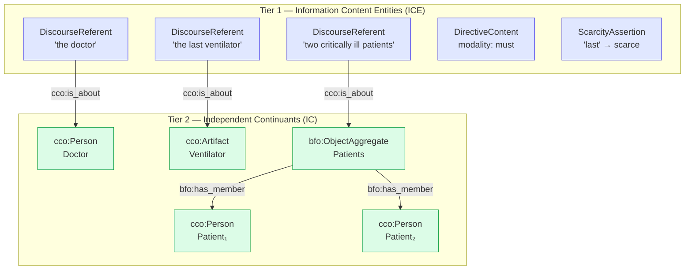
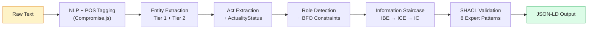
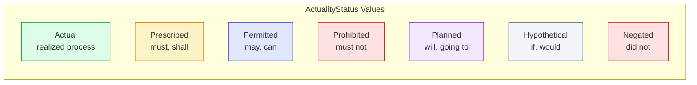
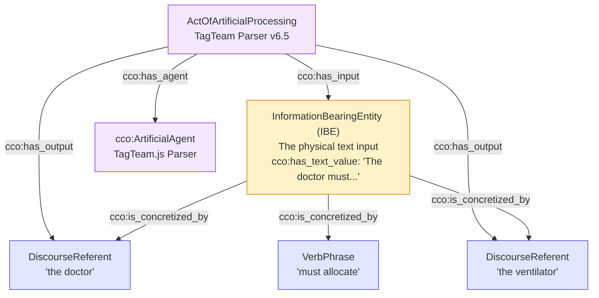
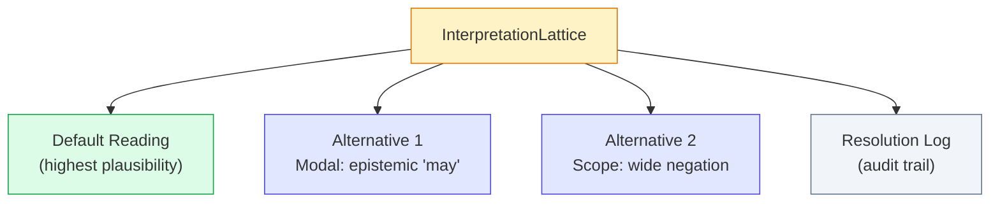

# TagTeam.js — Architecture Overview for Ontology Experts

**Audience:** BFO/CCO practitioners, semantic web researchers, ontology engineers
**Purpose:** Explain how TagTeam.js transforms natural language into BFO/CCO-compliant JSON-LD graphs

---

## What TagTeam.js Does

TagTeam.js is a client-side JavaScript library that takes a plain-English sentence and produces a BFO/CCO-compliant JSON-LD knowledge graph. It runs entirely in the browser with no server calls.

**Input:**
```
"The doctor must allocate the last ventilator between two critically ill patients"
```

**Output:** A JSON-LD `@graph` array containing typed, linked nodes — entities, acts, roles, an information staircase, and validation metadata — all grounded in BFO and CCO IRIs.

---

## The Core Idea: Two-Tier Architecture

TagTeam enforces BFO's fundamental distinction between *what a text says* (information) and *what it is about* (reality). Every parse produces two layers:



**Why two tiers?** The same real-world entity (IC) can be mentioned multiple times in a text (multiple ICEs). A single `cco:Person` node may have several `DiscourseReferent` nodes pointing at it via `cco:is_about`. This preserves the BFO distinction and avoids conflating linguistic reference with ontological identity.

---

## Pipeline Overview



Each stage adds nodes and edges to the graph. The pipeline is deterministic — the same input always produces the same output.

---

## BFO/CCO Classes Instantiated

TagTeam uses real BFO and CCO IRIs, not approximations. The table below shows the actual classes the parser instantiates:

### Entities (Independent Continuants)

| Text Pattern | BFO/CCO Type | Rationale |
|---|---|---|
| Named/referred persons | `cco:Person` | Human agents |
| Physical objects | `cco:Artifact` | Material artifacts |
| Groups, committees | `cco:Organization` | Collective agents |
| Plural entities | `bfo:BFO_0000027` (ObjectAggregate) | With individual `has_member` links |
| Symptoms (pain, fever) | `bfo:BFO_0000019` (Quality) | Inheres in bearer |
| Diseases | `bfo:BFO_0000016` (Disposition) | Per OGMS alignment |
| Time expressions | `bfo:BFO_0000038` (1D Temporal Region) | Duration/interval |
| Documents, plans | `bfo:BFO_0000031` (GDC) | Information artifacts |
| Pronouns ("it") | `bfo:BFO_0000004` (IndependentContinuant) | Underspecified referent |

### Acts (Processes)

| Text Pattern | CCO Act Type |
|---|---|
| allocate, distribute, ration | `cco:ActOfAllocation` |
| treat, prescribe, diagnose | `cco:ActOfMedicalTreatment` |
| tell, inform, report | `cco:ActOfCommunication` |
| decide, choose | `cco:ActOfDecision` |
| Default verb | `cco:IntentionalAct` |

### Roles (Specifically Dependent Continuants)

| Role | BFO Class | Constraint |
|---|---|---|
| Agent (performer) | `cco:AgentRole` | Bearer must be `cco:Person` or `cco:Organization` |
| Patient (affected) | `cco:PatientRole` | Bearer must be `cco:Person` — not artifacts |
| Recipient | `cco:RecipientRole` | Transfer target |
| Instrument | `cco:InstrumentRole` | Tool used in act |

All roles are linked to their bearers via `bfo:inheres_in` (BFO_0000052) and to acts via `bfo:realized_in` (BFO_0000054).

---

## ActualityStatus: Modality as Ontological Commitment

Every act node carries an `ActualityStatus` that reflects its ontological standing:



**Critical constraint:** Role realization (`bfo:realized_in`) applies only to `Actual` acts. For `Prescribed` or `Planned` acts, the property `tagteam:would_be_realized_in` is used instead, because unrealized processes cannot realize dispositions under BFO.

---

## The Information Staircase (GIT-Minimal)

TagTeam implements a minimal version of Generalized Information Theory to track provenance:



The parser itself is modeled as a `cco:ArtificialAgent` performing an `cco:ActOfArtificialProcessing`, with the input text as IBE and the extracted ICEs as outputs. This makes the parsing act itself a first-class citizen in the ontology.

---

## SHACL Validation: 8 Expert-Certified Patterns

TagTeam validates its own output against SHACL-like constraint patterns derived from BFO/CCO axioms:

| # | Pattern | Severity | What It Checks |
|---|---|---|---|
| 1 | Information Staircase | Violation | ICE must link to IBE via `cco:is_concretized_by` |
| 2 | Role–Bearer | Violation | Every Role must `bfo:inheres_in` a bearer |
| 3 | Designation | Violation | Designative ICE must designate a referent |
| 4 | Temporal Interval | Violation | Start time must precede end time |
| 5 | Measurement | Violation | Measurements require value + unit + target quality |
| 6 | Socio-Primal | Warning | Acts should have temporal grounding and participants |
| 7 | Domain/Range | Violation | `cco:has_agent` range must be an agent, not an artifact |
| 8 | Vocabulary | Warning | Detects typos in BFO/CCO/tagteam terms via edit distance |

Patterns 1–5 and 7 are hard violations — they represent states that are ontologically impossible under BFO. Patterns 6 and 8 are warnings for underspecification.

---

## Ambiguity Handling

When the parser encounters genuine ambiguity, it does not guess. Instead, it builds an **Interpretation Lattice** that preserves multiple readings:



Ambiguity types detected:
- **Modal force:** "may" as epistemic possibility vs. deontic permission
- **Selectional violations:** Inanimate subjects in agent position
- **Noun category:** "organization" as entity vs. process nominalization
- **Quantifier scope:** "All patients did not consent" (none vs. not-all)

High-confidence resolutions (selectional evidence > 0.7) collapse to a single reading. Low-confidence cases are preserved for downstream consumers to resolve.

---

## Namespaces

```json
{
  "bfo":     "http://purl.obolibrary.org/obo/",
  "cco":     "http://www.ontologyrepository.com/CommonCoreOntologies/",
  "tagteam": "http://tagteam.fandaws.org/ontology/",
  "inst":    "http://tagteam.fandaws.org/instance/",
  "rdf":     "http://www.w3.org/1999/02/22-rdf-syntax-ns#",
  "rdfs":    "http://www.w3.org/2000/01/rdf-schema#",
  "owl":     "http://www.w3.org/2002/07/owl#",
  "xsd":     "http://www.w3.org/2001/XMLSchema#"
}
```

The `tagteam:` namespace is used only for properties and classes that have no existing BFO/CCO equivalent (e.g., `tagteam:actualityStatus`, `tagteam:denotesType`, `tagteam:DiscourseReferent`). All standard ontological relations use their canonical BFO/CCO IRIs.

---

## Design Constraints

| Constraint | Rationale |
|---|---|
| Deterministic | Same input always produces same graph — no LLM, no randomness |
| Client-side only | Runs in browser, no server dependency |
| No discourse memory | Each sentence parsed independently (v1 scope) |
| No coreference resolution | Cross-sentence "he/she" linking deferred to v2 |
| Bounded complexity | ComplexityBudget enforces node/edge limits |
| Self-validating | Every graph is checked against SHACL patterns before output |

---

## Example Output Fragment

For the sentence *"The doctor must allocate the last ventilator"*:

```json
{
  "@context": { "bfo": "http://purl.obolibrary.org/obo/", "cco": "http://www.ontologyrepository.com/CommonCoreOntologies/", "...": "..." },
  "@graph": [
    {
      "@id": "inst:DiscourseReferent_doctor_a8f3",
      "@type": ["tagteam:DiscourseReferent", "owl:NamedIndividual"],
      "rdfs:label": "the doctor",
      "tagteam:denotesType": "cco:Person",
      "tagteam:definiteness": "definite",
      "cco:is_about": { "@id": "inst:Person_Doctor_f2a9" }
    },
    {
      "@id": "inst:Person_Doctor_f2a9",
      "@type": ["cco:Person", "owl:NamedIndividual"],
      "rdfs:label": "Doctor"
    },
    {
      "@id": "inst:Act_allocate_b3c7",
      "@type": ["cco:ActOfAllocation", "bfo:BFO_0000015", "owl:NamedIndividual"],
      "tagteam:verb": "allocate",
      "tagteam:actualityStatus": { "@id": "tagteam:Prescribed" },
      "cco:has_agent": { "@id": "inst:Person_Doctor_f2a9" },
      "tagteam:modality": "must"
    },
    {
      "@id": "inst:AgentRole_doctor_d4e1",
      "@type": ["bfo:BFO_0000023", "cco:AgentRole", "owl:NamedIndividual"],
      "bfo:BFO_0000052": { "@id": "inst:Person_Doctor_f2a9" },
      "tagteam:would_be_realized_in": { "@id": "inst:Act_allocate_b3c7" }
    }
  ]
}
```

Note that the AgentRole uses `tagteam:would_be_realized_in` (not `bfo:realized_in`) because the act has `Prescribed` status — the allocation has not yet occurred.
